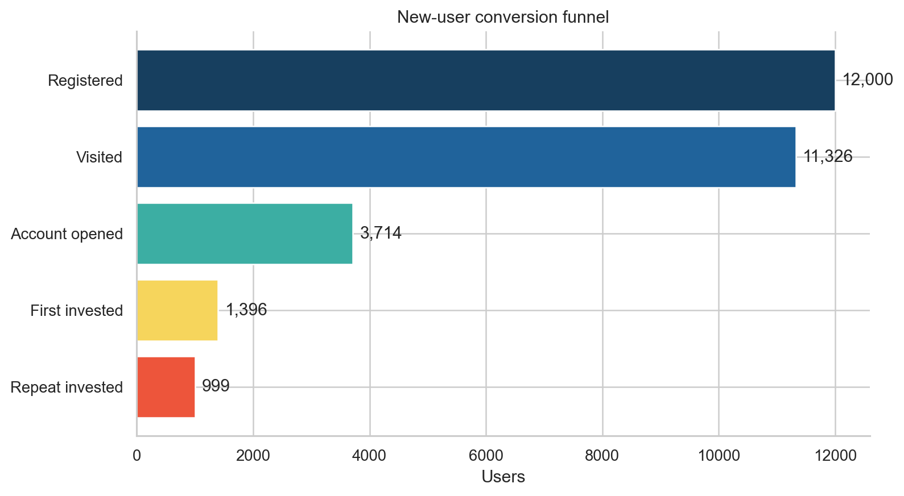
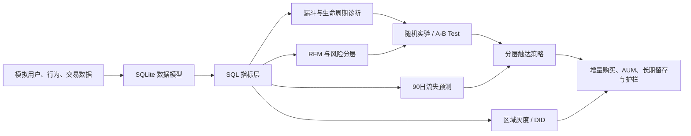
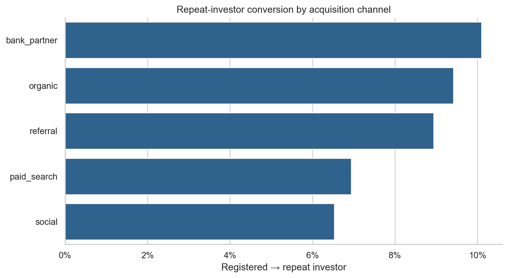
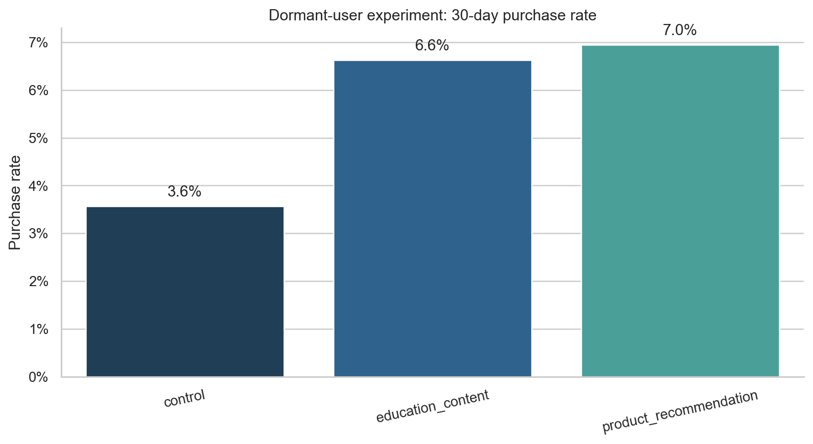
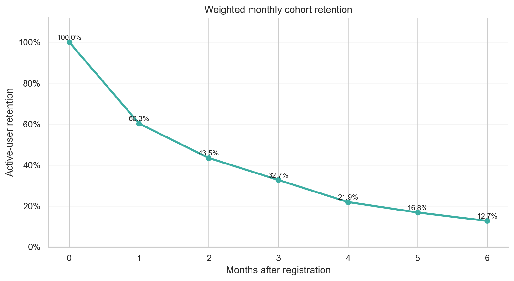
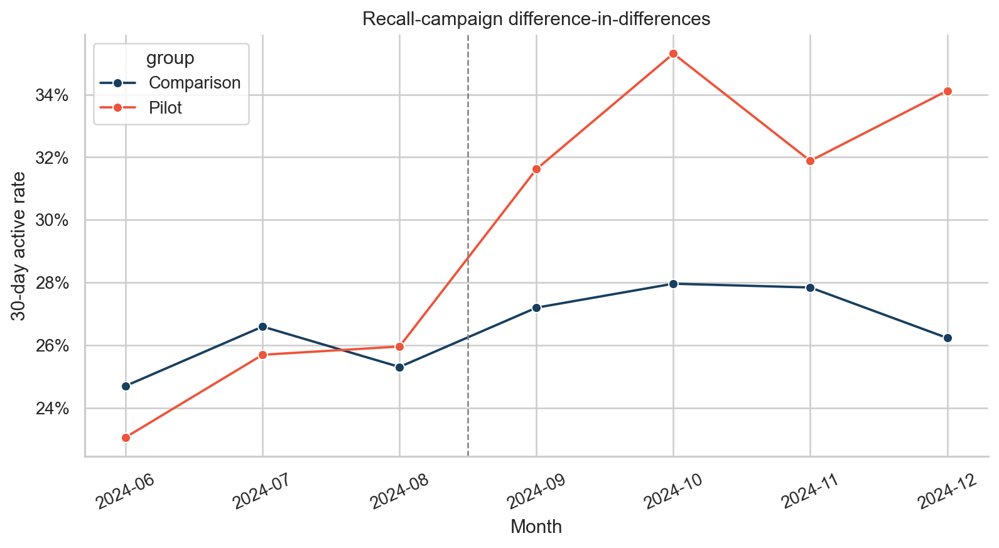

# Wealth User Strategy Analytics

> 互联网财富平台新用户转化与沉睡用户激活：从 SQL 诊断、用户分层到 A/B 测试、DID 和流失预测的完整策略分析项目。

**项目定位：** 财富业务策略分析作品集 · **数据：** 100% 可复现模拟数据 · **技术：** SQL / Python / SQLite / statsmodels



## 主要业务结论

平台最大的增长断点位于“注册 → 开户”：12,000 名注册用户中开户率仅 **31.0%**；对沉睡用户的随机实验显示，个性化产品推荐将 30 日购买率从 **3.6% 提升到 7.0%（+3.38pp，p<0.001）**，但教育内容在谨慎型用户和长期留存上更优，因此建议采用“风险偏好 × 生命周期”路由，而不是全量发送同一权益。

## 关键发现

- 注册 → 开户流失 69.0%，是首要优化环节；开户后的首投率为 37.6%，首投后的复投率为 71.6%。
- 银行合作渠道开户率最高（41.0%），自然渠道端到端复投率最高（9.4%）；社交渠道端到端仅 6.5%。
- 发现 2,351 名“高现金、未投资”用户，是风险可控的新客教育与低波动产品承接人群。
- 沉睡召回实验中，产品推荐提升购买率 **3.38pp**；教育内容提升 **3.06pp**，且 30 日留存达到 **19.5%**，高于产品推荐的 16.0%。
- 异质性结果表明：谨慎型用户更适合教育内容，平衡/进取型用户更适合适当性约束下的产品推荐。
- 区域灰度活动的 DID 估计为活跃率 **+6.56pp**（95% CI: 4.47pp—8.64pp）。
- 轻量流失模型测试集 AUC 为 **0.658**；它适合做运营名单排序，不适合替代随机实验或合规判断。

## 从数据到策略



## 策略建议

| 人群 | 识别规则 | 动作 | 核心指标 | 护栏 |
|---|---|---|---|---|
| 新注册未开户 | 注册后 3 日未开户 | 简化开户路径、分步解释 KYC | 开户率 | 客诉、审核失败率 |
| 高现金未投资 | 现金 ≥ 20,000 且无申购 | 现金管理教育 + 低风险产品承接 | 首投率、增量 AUM | 风险适配、7 日赎回 |
| 谨慎型沉睡 | 45 日未访问、谨慎型 | 教育内容优先 | 30 日购买、留存 | 退订、投诉 |
| 平衡/进取型沉睡 | 45 日未访问、已完成测评 | 风险匹配的产品推荐 | 增量购买、AUM | 波动暴露、赎回率 |
| 高价值风险用户 | 高 AUM、90 日未购买 | 人工/专属内容召回 | 资产留存 | 触达频率、合规审查 |

完整的业务推导、实验设计、成本收益和上线节奏见 [`docs/strategy_report.md`](docs/strategy_report.md)。

## 分析能力与方法
- **SQL：** 多表连接、条件聚合、首次行为、窗口函数、`NTILE` 分位数、cohort 留存、累计 AUM、环比、用户级防重复计数。
- **实验：** 分层随机、ITT、核心/护栏指标、双样本比例检验、置信区间、MDE 与样本量、异质性效果。
- **因果推断：** 用户—月份面板、DID、月份固定效应、用户聚类标准误、平行趋势可视化。
- **建模：** 时间切分防泄漏、逻辑回归、AUC、Top-20% 名单 precision、模型结果转运营动作。
- **财富业务：** AUM、申购/赎回、风险偏好、适当性、产品差异、长期留存和用户保护。
- **工程化：** 固定随机种子、数据字典、指标口径、SQLite 约束、单元测试、GitHub Actions。

## 项目结构

```text
.
├── data/raw/                 # 可公开的模拟明细数据
├── docs/                     # 策略报告、指标口径、数据字典、面试讲解
├── outputs/charts/           # 自动生成的分析图
├── outputs/tables/           # SQL 与统计分析结果
├── sql/                      # 建表 + 7 组业务 SQL
├── src/                      # 数据生成、入库、查询、实验、DID、模型
├── tests/                    # 数据与业务逻辑质量检查
├── Makefile
└── requirements.txt
```

## 快速复现

推荐 Python 3.11+。

```bash
python -m venv .venv
source .venv/bin/activate
pip install -r requirements.txt
python -m src.pipeline
python -m unittest discover -s tests -v
```

也可以运行：

```bash
make all
make test
```

流水线会依次：生成数据 → 创建 SQLite 数据库 → 执行 SQL → 统计检验与建模 → 导出表格和图表。固定随机种子保证结果可复现。

## 结果图

| 渠道转化 | A/B 测试 |
|---|---|
|  |  |

| 留存 | DID |
|---|---|
|  |  |

## 数据伦理与限制

这是用于展示分析方法的模拟案例，不代表任何真实公司的经营结果，也不构成投资建议。模型生成的购买倾向只用于排序候选人群；真实财富业务上线还必须校验营销同意、风险测评有效期、产品风险等级、冷静期、频控、投诉和弱势用户保护。任何触达策略都应通过随机实验验证增量效果，并持续观察长期留存和赎回风险。

