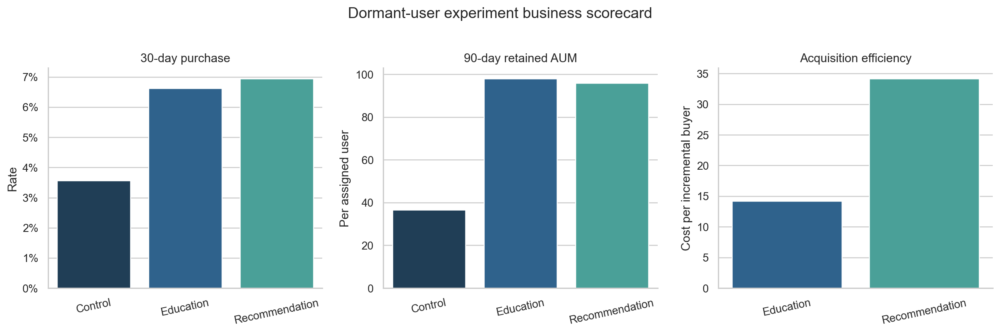

# 互联网财富平台用户经营策略分析

本项目模拟大型互联网财富平台的一次用户经营专项：在合规和风险适配约束下，诊断新客转化问题，评估沉睡用户召回策略，并形成可以进入下一轮灰度实验的经营方案。

数据包含12,000名模拟用户、行为流水、交易流水、产品、随机实验和区域活动面板。所有数据均由固定随机种子生成，不包含真实用户信息。

## 1. 主要业务结论与经营决策

> **当前决策：优先治理新客开户断点；沉睡召回不全量上线产品推荐，先验证分层路由。**

### 新客经营

- 12,000名注册用户中只有31.0%完成开户，69.0%的用户在投资前流失，是规模最大的经营断点。
- 目前证据只能定位到“注册—开户”，不能直接断言是KYC、风险测评还是绑卡造成流失。
- 下一步应补齐开户子漏斗埋点，并分别测试流程简化、进度提示和人工帮助，而不是继续单纯扩大注册量。

### 沉睡召回

- 产品推荐把30日购买率从3.57%提高至6.95%，每万名目标用户预计多带来338名购买者。
- 但产品推荐投诉率为1.04%，超过预设的1%扩量红线；每增量购买者成本为34.19，也显著高于教育内容的14.18。
- 教育内容购买率为6.63%，每万名用户预计增加约61.4万模拟90日留存AUM，高于产品推荐的约59.3万，同时投诉和赎回风险更低。
- 因此不建议全量上线统一产品推荐。下一轮实验采用：谨慎型教育、平衡型产品推荐、进取型教育，并保留长期对照组。

## 2. 指标体系

项目没有把点击率或一次购买当作最终目标，而是建立了经营指标树。

| 层级 | 指标 | 业务作用 |
|---|---|---|
| 北极星指标 | 90/180日增量留存AUM | 衡量策略带来的长期资产价值 |
| 核心结果 | 开户率、首投率、复投率、增量购买者 | 衡量生命周期推进 |
| 价值指标 | 30日净AUM、90日留存AUM | 区分短期购买和长期价值 |
| 效率指标 | 单用户触达成本、每增量购买者成本 | 判断策略是否值得扩量 |
| 先导指标 | 送达率、点击率 | 用于实验过程监控，不单独作为成功标准 |
| 风险护栏 | 投诉率、购买后赎回率、适当性通过率 | 防止转化增长以损害用户为代价 |

模拟项目使用以下扩量红线：投诉率不高于1%、购买者赎回率不高于20%、产品适当性通过率必须达到100%。

## 3. 新客漏斗诊断


| 环节 | 用户数 | 环节转化率 |
|---|---:|---:|
| 注册 | 12,000 | — |
| 访问 | 11,326 | 94.4% |
| 开户 | 3,714 | 31.0%（占注册） |
| 首投 | 1,396 | 37.6%（占开户） |
| 复投 | 999 | 71.6%（占首投） |

首投后的复投率达到71.6%，说明最大的绝对损失发生在投资之前。业务上应优先建设以下开户子漏斗：

```text
开户页曝光 → 开始开户 → 身份验证 → 风险测评 → 绑卡 → 开户完成
```

本项目没有模拟这些子步骤，因此“优化开户流程”是下一步待验证假设，而不是已经被因果识别的结论。

## 4. 沉睡用户随机实验

### 实验设计

- 入组：允许营销、注册满60日、连续45日未访问。
- 分层：按风险偏好和城市层级分层随机。
- 分组：对照组、教育内容组、产品推荐组。
- 分析：ITT口径，未送达用户仍保留在原分组。
- 样本：5,793人；检测2pp提升时，每组至少需要1,691人，实际每组约1,930人。

### 经营结果



| 指标 | 对照 | 教育内容 | 产品推荐 |
|---|---:|---:|---:|
| 30日购买率 | 3.57% | 6.63% | 6.95% |
| 每万名增量购买者 | — | 306 | 338 |
| 每用户90日留存AUM | 36.67 | 98.04 | 95.97 |
| 每万名增量90日留存AUM | — | 613,685 | 593,043 |
| 每增量购买者成本 | — | 14.18 | 34.19 |
| 购买者赎回率 | 8.70% | 10.16% | 14.18% |
| 投诉率 | 0.16% | 0.10% | **1.04%** |
| 产品适当性通过率 | — | — | 100% |
| 经营护栏 | 基准 | 通过 | **未通过：投诉越线** |

金额均为模拟货币单位。产品推荐的购买提升显著，但它没有通过全部经营护栏，因此“短期转化最高”不能直接转化为“全量上线”。

## 5. 分层路由方案

异质性结果用于形成下一轮实验假设，不直接作为全量策略。

| 风险偏好 | 下一轮策略 | 主要证据 | 需要重点监控 |
|---|---|---|---|
| 谨慎型 | 教育内容 | 购买率7.48%，高于产品推荐6.52%；投诉率仅0.14% | 首投、90日留存AUM |
| 平衡型 | 产品推荐 | 购买率7.21%，每用户90日留存AUM 137.11，投诉率0.95% | 投诉率接近红线 |
| 进取型 | 教育内容 | 产品推荐购买率更高，但赎回率19.23%接近红线，90日留存AUM仅61.68；教育内容为120.31 | 赎回、长期持有 |

下一轮实验应直接比较“分层路由”与现有策略，而不是把本次探索性异质性结果直接上线。

## 6. 灰度上线与停止规则

| 阶段 | 流量 | 主要任务 | 进入下一阶段条件 |
|---|---:|---|---|
| 数据验证 | 0% | 校验分群、埋点、随机化和适当性规则 | 数据质量测试全部通过 |
| 小流量实验 | 10% | 验证分层路由，并保留长期holdout | 购买、90日AUM均为正增量 |
| 扩大灰度 | 30% | 检查渠道、风险偏好和资产层级稳定性 | 投诉、赎回和适当性护栏通过 |
| 稳定运营 | 逐步扩量 | 持续监控成本与长期AUM | 保留5%—10%长期对照 |

任何阶段出现以下情况应停止扩量：

- 投诉率高于1%；
- 购买者30日赎回率超过20%；
- 产品适当性通过率低于100%；
- 90日增量留存AUM转负；
- 每增量购买者成本超过业务可接受上限。

## 7. 其他分析模块

### 区域灰度活动

无法随机分配的区域活动使用DID评估，模型包含月份固定效应并按用户聚类标准误。估计的增量活跃率为6.56pp，95%置信区间为4.47pp—8.64pp。真实业务还需要事件研究、同期活动排查和安慰剂检验。

### 流失名单排序

逻辑回归使用截止日前的访问、内容、交易、AUM和用户属性预测未来90日流失，测试集AUC为0.658。模型只用于运营名单排序；模型命中率不等于触达增量，仍需实验验证。

## 8. 数据与系统架构

```text
模拟用户/产品/行为/交易
        ↓
SQLite数据模型与约束
        ↓
SQL指标层：漏斗、留存、分层、经营看板、模型特征
        ↓
Python：显著性检验、DID、流失模型、可视化
        ↓
经营决策：人群 × 策略 × 收益 × 成本 × 护栏
```

```text
.
├── src/                  # 数据生成、建库、统计分析与图表
├── sql/                  # 漏斗、留存、实验看板、路由和模型特征
├── tests/                # 数据质量、随机化、适当性和经营护栏测试
├── outputs/
│   ├── charts/           # 核心经营图表
│   ├── tables/           # 精选经营结果表
│   └── analysis_summary.json
├── requirements.txt
└── Makefile
```

模拟明细数据和用户级中间表在运行时生成，不提交到仓库。

## 9. 复现方法

推荐使用Python 3.11或更高版本。

```bash
git clone https://github.com/Shuxinz0316/wealth-user-strategy-analytics.git
cd wealth-user-strategy-analytics
python -m venv .venv
source .venv/bin/activate
pip install -r requirements.txt
python -m src.pipeline
python -m unittest discover -s tests -v
```

也可以运行：

```bash
make install
make run
make test
```

GitHub Actions会在每次提交时从零生成数据并运行全部测试。

## 10. 结果文件

- `outputs/analysis_summary.json`：漏斗、实验、经营价值、护栏和模型摘要。
- `outputs/tables/experiment_results.csv`：实验经营看板。
- `outputs/tables/strategy_routing.csv`：风险偏好分层证据和下一轮策略。
- `outputs/charts/`：漏斗、留存、实验、DID和模型图表。

## 11. 数据伦理

这是用于展示分析方法的模拟案例，不代表任何真实公司的经营结果，也不构成投资建议。

模型生成的购买倾向只用于排序候选人群；真实财富业务上线还必须校验营销同意、风险测评有效期、产品风险等级、冷静期、频控、投诉和弱势用户保护。任何触达策略都应通过随机实验验证增量效果，并持续观察长期留存和赎回风险。

## 12. 边界与假设

- 触达成本、投诉红线和适当性规则是显式模拟假设，不是行业统一标准。
- 项目没有真实产品费率、渠道成本、市场行情、用户投诉文本和180日资产数据，因此不能计算真实利润或LTV。
- 在真实业务中，需要由产品、运营、数据、算法、合规和客服共同确认指标口径与上线规则。
